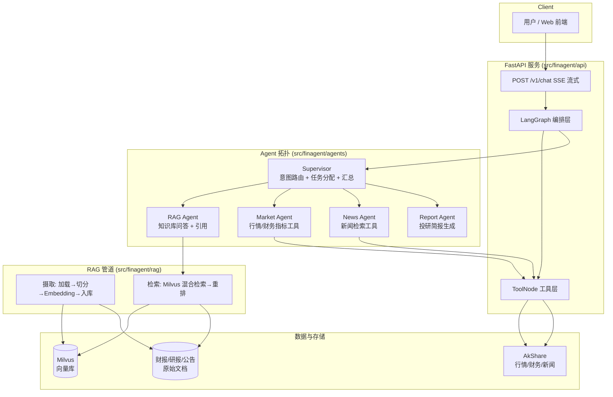

# FinAgent — 金融投研助手 · 架构设计文档 v0.1

> 简历级 AI Agent 项目。本文档是整个项目的蓝图：所有代码、文档、博客都围绕它展开。
> 版本：v0.1（2025） · 状态：草稿，随开发迭代

---

## 1. 项目定位

**一句话**：一个基于「多智能体编排 + RAG + 工具调用」的金融投研助手，能回答财报/研报问题（带引用溯源）、查询实时行情、抓取新闻并生成投研简报。

**简历卖点**（对着 JD 讲）：

| 能力 | 对应技能 |
|---|---|
| 多智能体编排（Supervisor 路由 → 子 Agent） | LangGraph 状态机、图设计 |
| 企业级 RAG（切分/Embedding/混合检索/引用溯源） | LangChain + Milvus + 评测 |
| 工具调用（function calling：行情/财务/新闻） | LangGraph ToolNode、工具设计 |
| 服务化与部署（流式输出 + 一键启动） | FastAPI + SSE + Docker Compose |
| 可评测可优化（指标驱动迭代） | Ragas + 人工标注 QA 集 |

**目标岗位画像**：国内初级/中级 AI Agent 开发、LLM 应用工程师、RAG 应用工程师。

---

## 2. 用户故事与核心能力

1. **智能问答**：用户问「贵州茅台 2023 年营收同比增长多少？」→ 从知识库检索财报内容 → 给出带引用来源的答案。
2. **实时行情**：用户问「今天宁德时代股价多少？」→ Agent 识别为工具调用 → 调 AkShare 实时行情工具。
3. **新闻洞察**：用户问「最近 AI 板块有什么新闻？」→ 调新闻搜索工具。
4. **投研简报**：用户说「帮我写一份贵州茅台的投资简报」→ Supervisor 协调多个子 Agent 收集数据 → 生成结构化简报。
5. **多轮对话**：追问、澄清（"那毛利率呢？"能接上文）。

---

## 3. 功能范围

| 阶段 | 范围 |
|---|---|
| **MVP（W1-W2）** | 财报/研报 RAG 问答（带引用）+ 单工具调用（行情查询）|
| **P1（W3-W4）** | LangGraph 多智能体（Supervisor + RAG Agent + Market Agent + News Agent）+ 流式输出 + Docker 部署 |
| **P2（W5-W6）** | 投研简报生成（Report Agent）+ Ragas 评测 + 优化 + 测试 + 文档博客 |

---

## 4. 技术选型

| 层 | 选型 | 理由 |
|---|---|---|
| 编排 | **LangGraph**（手动 StateGraph） | JD 高频技能；比裸 LangChain Agent 更能展示工程深度 |
| RAG 框架 | **LangChain**（加载/切分/检索组件） | 与 LangGraph 同生态，集成 Milvus 成熟 |
| 备选对照 | LlamaIndex 版 RAG 管道（实验分支） | 用户已熟悉，做 A/B 对比写进博客，展示框架理解深度 |
| 向量库 | **Milvus v2.4+**（Docker standalone） | 用户已熟悉；支持混合检索（Dense + Sparse BM25）加分 |
| LLM | **DeepSeek-chat**（主力，便宜） | 国内可用、OpenAI 兼容接口 |
| Embedding | text-embedding-v3（DeepSeek）或 text-embedding-3-small（OpenAI） | 通过 .env 可切换 |
| 服务层 | **FastAPI + SSE**（流式输出） | 简历技能 + 真实产品体验 |
| 数据源 | **AkShare**（财务/行情/新闻，免费） | 无需付费 key，可演示真实数据 |
| 评测 | **Ragas**（faithfulness / answer_relevancy / context_precision / context_recall） | 指标驱动迭代，面试加分项 |
| 部署 | **Docker Compose**（etcd + minio + milvus + api） | 一键启动，README 可演示 |
| 测试 | pytest（单测 + RAG 管道冒烟测试） | 工程完备性 |

> 决策说明：主线框架选 LangGraph + LangChain 而非 LlamaIndex，是因为当前国内 Agent 岗位 JD 中 LangGraph 出现频率最高，且与用户已有 LangChain 基础衔接最顺。LlamaIndex 作为二期对照实验保留（P2）。

---

## 5. 系统架构



**主流程（以"写一份贵州茅台投研简报"为例）**：
1. 用户输入 → FastAPI 接口 → LangGraph 图启动，入口节点 = Supervisor。
2. Supervisor 用 LLM 做意图识别：判定为"综合任务"，按计划派发子任务。
3. RAG Agent 从 Milvus 检索财报/研报片段，生成带 `[1][2]` 引用的回答。
4. Market Agent 调 AkShare 拿实时行情与财务指标。
5. News Agent 检索最近新闻。
6. Report Agent 汇总以上结果，输出结构化 Markdown 简报（带数据来源）。
7. 全流程通过 SSE 流式返回给用户。

---

## 6. Agent 拓扑与工具清单

### 6.1 Agent 设计

| Agent | 职责 | 输入 → 输出 | 依赖 |
|---|---|---|---|
| **Supervisor** | 意图识别、任务规划、结果汇总、多轮上下文 | 用户消息 → 子任务列表 + 最终汇总 | LLM |
| **RAG Agent** | 知识库问答，强制带引用 | 问题 → 回答 + 引用来源 | RAG 管道 |
| **Market Agent** | 行情/财务数据工具调用 | 股票名称 → 结构化数据 | 工具层 |
| **News Agent** | 新闻搜索与摘要 | 主题 → 新闻列表 + 摘要 | 工具层 |
| **Report Agent** | 简报生成 | 结构化数据 → Markdown 简报 | LLM |

### 6.2 工具清单（function calling）

| 工具 | 说明 | 数据源 |
|---|---|---|
| `get_stock_realtime_quote(symbol)` | 实时行情（价格/涨跌幅/成交量） | AkShare |
| `get_financial_indicators(symbol, year)` | 营收/净利润/毛利率/ROE 等 | AkShare |
| `search_news(keyword, limit)` | 新闻检索 | AkShare |
| `get_stock_history(symbol, days)` | 历史行情序列（K 线） | AkShare |

> 工具全部走 AkShare 免费接口，本地可直接运行演示；生产可替换为 Wind/同花顺/Bloomberg 等商业源（面试可讲）。

### 6.3 演进路径（刻意展示深度）

- **MVP**：`create_react_agent`（LangGraph 预置，快）→ 打通全链路。
- **P1**：改为**手动 StateGraph**（显式状态、节点、条件边），展示对图编排的真实理解，这是面试深挖点。
- **P2**：加 Supervisor 子图（`StateGraph` 嵌套）、结构化输出（`with_structured_output`）。

### 6.4 LlamaIndex 局部引入计划（主线仍为 LangChain）

主线用 LangChain/LangGraph 完成全项目；RAG 检索环节**局部引入 LlamaIndex** 增强（只改 `rag/` 内部，`answer()` 对外接口不变，Agent 层无感）：

| 引入点 | LlamaIndex 做什么 | 解决什么 |
|---|---|---|
| ① 增量索引 | `VectorStoreIndex` 自动维护索引 | 新增文档只更新增量，避免全量重灌 |
| ② 查询引擎 | `as_query_engine()` 多文档合成回答 | 跨文档汇总更自然 |
| ③ 元数据过滤 | 按股票/年份等元数据过滤检索 | 检索更精准 |

> 设计原则：对外接口稳定、内部实现可替换（与"数据源可替换"同理）。面试可讲"双框架对比实验"。

---

## 7. 数据与知识库设计

### 7.1 数据源
1. **财报数据（结构化）**：AkShare `stock_financial_abstract` / `stock_financial_analysis_indicator` 拉取主要 A 股（如贵州茅台 600519、宁德时代 300750）近 3-5 年财务数据，转成**中文叙述文本**（"2023 年贵州茅台实现营业收入 1476.94 亿元，同比增长 19.01%…"）作为知识库文档。
2. **研报/公告（文本）**：公开财报摘要 + 自建 10-20 份研报风格样本文档（手工整理，注明来源与日期）。
3. **新闻/行情（实时，不入库）**：工具调用时实时拉取。

### 7.2 知识库文档格式
每篇文档带元数据：`{source, title, date, symbol, doc_type}`，检索结果必须携带来源，支撑引用溯源。

### 7.3 切分策略
- 按文档结构（每份财报的章节：营业收入/利润/资产负债…）做**语义切分**（结构化文本直接按节切）。
- 通用兜底：`RecursiveCharacterTextSplitter(chunk_size=800, chunk_overlap=100)`。
- 记录 `chunk -> 文档` 映射，检索命中后回链到来源文档。

---

## 8. RAG 管道设计

```mermaid
flowchart LR
    DOC[原始文档] --> SPLIT[语义/递归切分]
    SPLIT --> EMB[Embedding API]
    EMB --> MILVUS[(Milvus)]
    Q[问题] --> QE[Query Embedding]
    QE --> H[混合检索<br/>Dense TopK + Sparse BM25]
    H --> RR[重排/去重]
    RR --> CTX[上下文组装<br/>+ 引用编号]
    CTX --> LLM[LLM 生成<br/>带 [1][2] 引用]
```

- **入库**：`scripts/ingest_docs.py` → 切分 → Embedding → 写入 Milvus collection `fin_docs`。
- **检索**：向量 Top-K（默认 5）+ 可选 Sparse（Milvus 2.4+ BM25）混合，融合去重。
- **引用溯源**：上下文带文档元数据，提示词强制 LLM 用 `[n]` 标注，返回 `citations` 字段。
- **评测**：Ragas 四指标 + 人工标注 20-30 条 QA，作为回归基线。

---

## 9. 工程化设计

- **API**：`POST /v1/chat`（SSE 流式，事件含 `token` / `tool_call` / `citation` / `done`）、`GET /health`。
- **配置**：`.env` + `pydantic-settings`（模型/Key/向量库地址全部可配）。
- **日志**：结构化日志（请求 ID、Agent 调用链、token 用量）。
- **部署**：`docker compose up` 一键起 etcd + minio + milvus + api。
- **测试**：pytest 单测 + RAG 冒烟测试（真实 Milvus 可选，默认打桩）。

---

## 10. 目录结构

```
financial_/
├── README.md                 # 项目首页：特性/快速开始/架构图
├── pyproject.toml
├── .env.example
├── .gitignore
├── docker-compose.yml
├── Dockerfile
├── docs/
│   └── 01-architecture.md    # 本文档
├── scripts/
│   ├── fetch_financial_data.py   # AkShare 拉数 → 叙述文本
│   ├── ingest_docs.py            # 切分 + Embedding + 入库 Milvus
│   └── eval_rag.py               # Ragas 评测
├── src/finagent/
│   ├── config.py             # pydantic-settings
│   ├── data/                 # 数据准备与文档构建
│   ├── rag/                  # 摄取/检索/引用
│   ├── agents/               # LangGraph 图 + 工具
│   ├── api/                  # FastAPI + SSE
│   └── eval/                 # 评测集与脚本
└── tests/
```

---

## 11. 里程碑计划（全职 4-6 周）

| 周 | 目标 | 产出 | 验收标准 |
|---|---|---|---|
| **W1** | 环境 + 数据 + MVP RAG | 数据脚本、Milvus 入库、`create_react_agent` 问答 | 能答 3 个财报问题且带引用 |
| **W2** | RAG 完善 | 混合检索、引用溯源、切分调优 | 20 条 QA 人工评估 ≥ 80% 正确 |
| **W3** | Agent 化 | 手动 StateGraph + 4 个工具 | 5 条端到端对话（含工具调用）通过 |
| **W4** | 服务化 + 部署 | FastAPI + SSE + Docker Compose | `docker compose up` 后浏览器可用 |
| **W5** | 评测 + 优化 | Ragas 基线 + 优化一轮 + pytest | 指标可复现、测试全绿 |
| **W6** | 包装 | GitHub 仓库 + 架构博客 + 简历项目段 + 面试讲稿 | README 能自证项目价值 |

---

## 12. 风险与备选

| 风险 | 应对 |
|---|---|
| AkShare 接口变动/限流 | 工具层加缓存 + 容错；数据脚本离线落盘 |
| Milvus 资源占用高 | 用 v2.4 standalone + 最小配置；备选 sqlite-vec/Chroma 对照（博客可写） |
| 模型效果不稳 | 固定 temperature、提示词版本化、评测基线把关 |
| DeepSeek embedding 不可用 | .env 一键切 OpenAI embedding |
| 范围膨胀 | 严守 MVP→P1→P2，每阶段有验收标准 |
